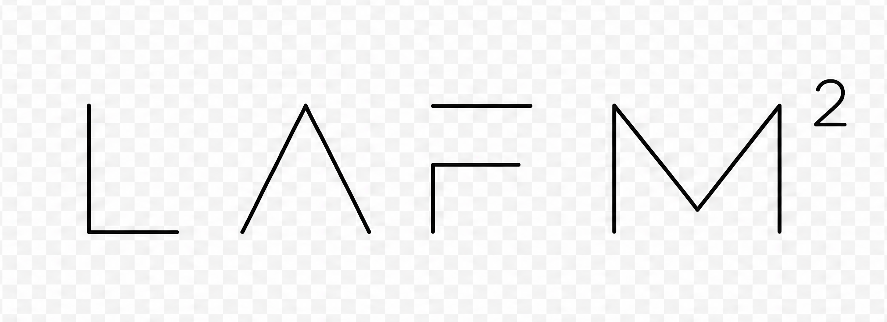

<p align="center">
  
</p>

# LAFMM

Jesse Livermore's six-column price recording system from *How to Trade in Stocks* (1940), run by an AI agent in your terminal.

You talk to the agent. It fetches prices, runs the engine, surfaces signals, imports your trades, and learns your patterns over time. The TUI and CLI are views into what the agent maintains.

## Install

Requires Python 3.14+ and [uv](https://docs.astral.sh/uv/).

```bash
git clone https://github.com/lemorage/lafmm.git
cd lafmm && uv sync
uv tool install -e .
lafmm
```

First run scaffolds `~/.lafmm/`, fetches US index prices, and launches [Claude Code](https://claude.ai/download) — the agent interface. Subsequent runs open the TUI.

```bash
lafmm                          # interactive market map
lafmm chart macd NVDA          # terminal charts
lafmm chart candle SPY -p 30d
lafmm stats                    # trading performance
lafmm stats --period 2026-Q1
lafmm sync                     # regenerate cache from data
lafmm tape today "bought NVDA" # trade thoughts
```

## The System

Two leaders per industry group. Each gets a 6-column sheet. Their combined price (Key Price) gets a third.

```
| Leader A (6 cols) | Leader B (6 cols) | Key Price (6 cols) |
```

Only Upward Trend and Downward Trend use ink. The rest are pencil: tentative. Signals fire when price confirms or fails at pivotal points. Group trend = Key Price. Market trend = majority of groups.

> *"There is danger of being caught in a false movement by depending upon only one stock."*

## Workspace

Everything is files. The agent reads and writes them. So can you.

```
~/.lafmm/
├── data/              # OHLCV prices
├── cache/             # computed engine state
├── accounts/          # broker configs, journals, NAV
├── profile.md         # risk tolerance, biases, rules
├── insights/          # agent observations over time
├── config.toml        # API keys
└── .claude/skills/    # what the agent can do
```

## License

GPLv3.
